# Portfolio

<!-- TABLE OF CONTENTS -->
<details>
  <summary>Table of Contents</summary>
  <ol>
    <li><a href="#about-the-project">About The Project</a></li>
    <li><a href="#set-up">Set Up</a>
      <ul>
        <li><a href="#clone-repository">Clone Repository</a></li>
        <li><a href="#zip-installation">Zip Installation</a></li>
      </ul>
    </li>
    <li><a href="#usage-guidelines">Usage Guidelines</a></li>
      <ul>
        <li><a href="#about-page">About Page</a></li>
        <li><a href="#skills-and-experience-page">Skills and Experience Page</a></li>
        <li><a href="#projects-page">Projects Page</a></li>
        <li><a href="#blog-page">Blog Page</a></li>
        <li><a href="#accessibility">Accessibility</a></li>
      </ul>
    <li><a href="#contact">Contact</a></li>
  </ol>
</details>


<!-- ABOUT THE PROJECT -->
## About The Project

Portfolio website made using HTML, CSS, JavaScript and PHP.

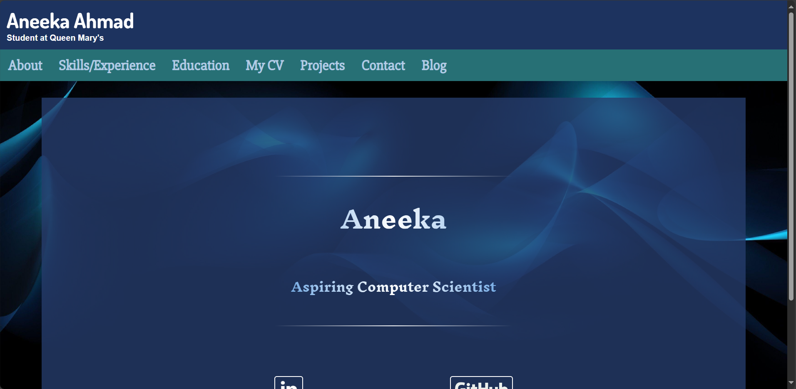

<!-- SETTING UP -->
## Set Up

1. **For correct displaying of PHP files and database**
  - XAMPP for Windows
  - MAMP for Mac

2. **Use one of these to open the portfolio site**
  - Microsoft Edge
  - Chrome
  - Firefox
  - Safari

<!-- GIT CLONE -->
## Clone Repository

1. Clone the repository
   ```sh
   git clone https://github.com/Pie-R-Squared/Portfolio.git
   ```

<!-- ZIP INSTALL -->
## Zip Installation

1. Download the zip file from the repository
2. Download size: approx. 40MB
3. Go to the Downloads folder and extract the file to C:\xampp\htdocs
4. Open Xampp/MAMP Control Panel and enable the Apache and SQL servers
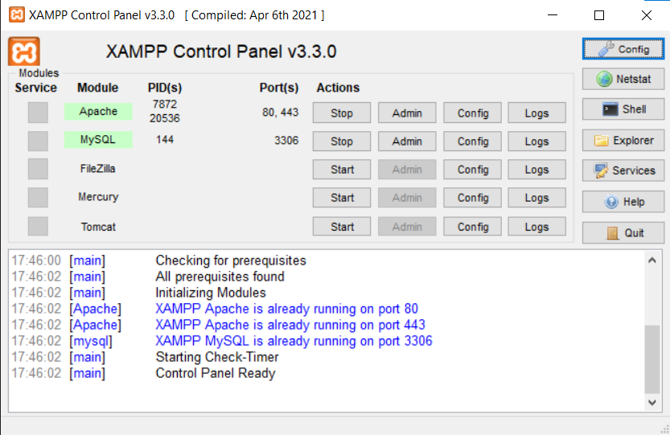
5. Go into your browser and type in https://localhost/aahmad-phase2/
6. Navigate around the website as shown below

<!-- USAGE GUIDE VIDEO -->
## Usage Guidelines
This video shows how to navigate around the website.


## About Page

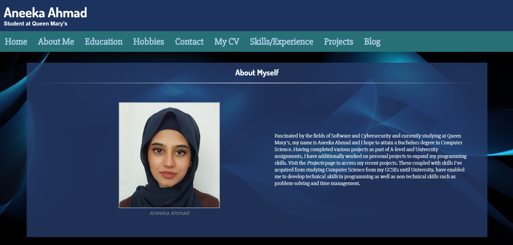

This is the about section which can be accessed by using the internal links above, or simply by default when opening up the about page. This offers a short introduction about my motivations and what I am currently studying. The layout of this part relied on flexbox and centre alignment. The image is in a figure tag along with a figure caption. The navigation bar uses flexbox.

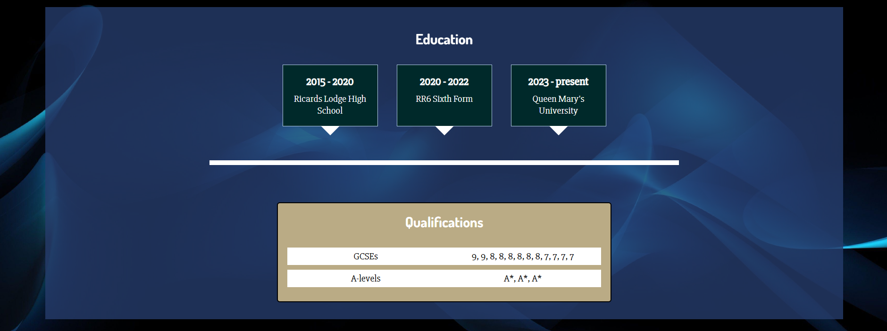

This is the education section which lists my qualifications and timeline of studies. Similarly, this used flexbox for the boxes as well as a grid layout for the qualifications.

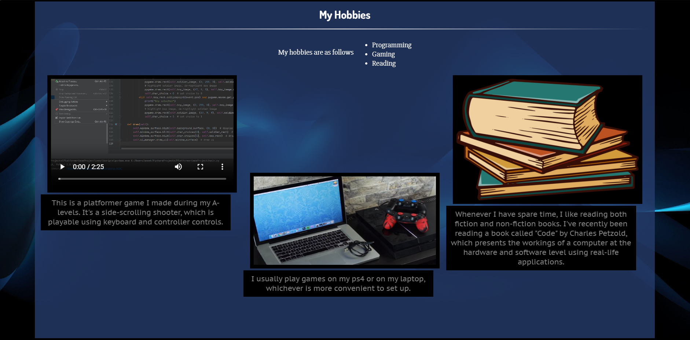

The hobbies section is comprised of a grid layout where each section was individually named and organised using grid-template-areas.

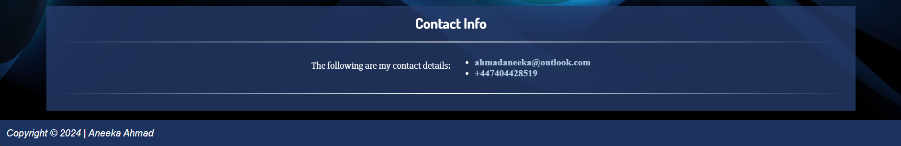

The contact section uses regular anchor tags but with a hover effect. This also uses flexbox.

## Skills and Experience Page

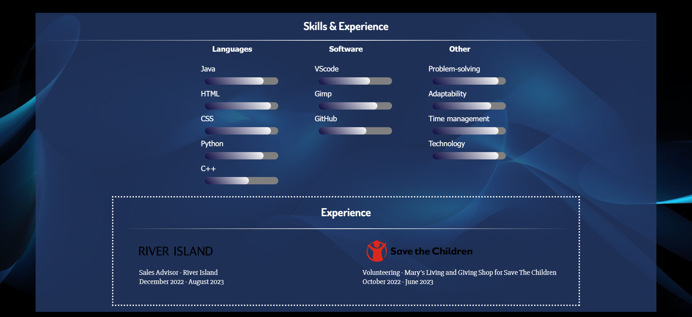

This page features progress bars to indicate skill level. Skills are divided into Languages, Software and Other soft skills. The layout is a grid using grid=template-areas, while the experiences container is a flexbox.

## Projects Page

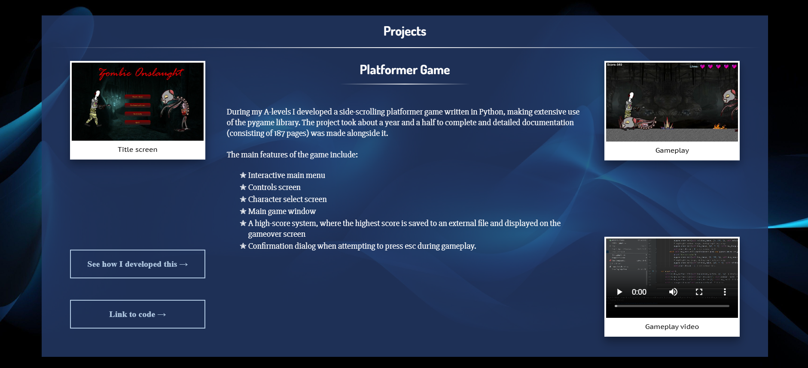

The projects page uses grid layout again but components have a slightly unique style. Videos and images use figure and figcaption elements in a polaroid style. Links take the user to the GitHub page as well as to videos of the development on YouTube. I've listed features at the bottom, to aid users in seeing the features more clearly.

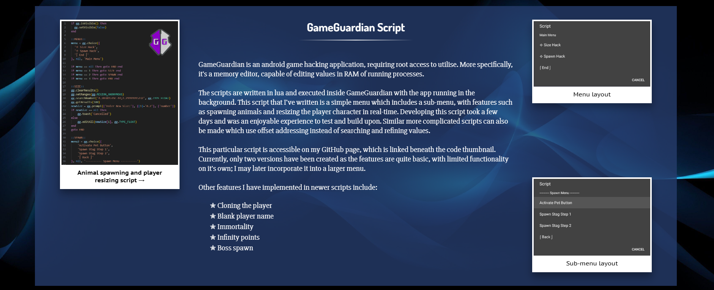

Both sections have consistent styles to fit with the rest of the site.

## Blog Page

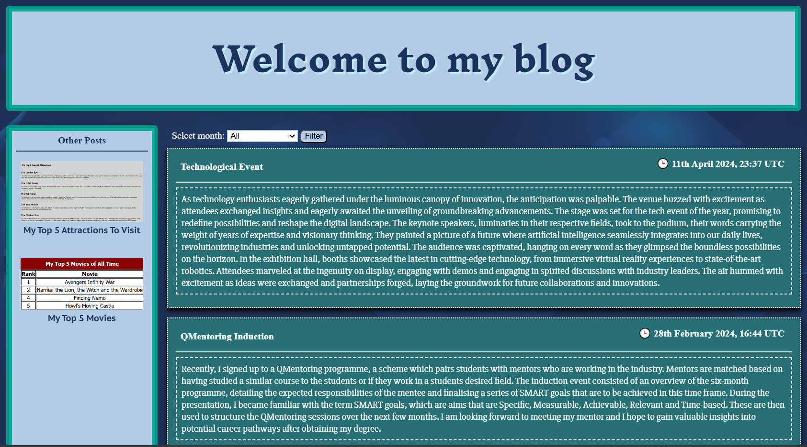

This page has the most features in the portfolio, enabling users to login and add posts, sort posts by month and view other pages. The blog uses information from the database on phpMyAdmin, whether to validate login credentials or to fill the blog with data. This functionality relies on the use of Xampp.

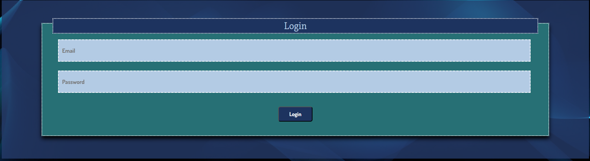

When the login button at the top is clicked or the user attempts to add a post, they are taken to the login page. This requires the user to enter the username and password, which is then validated against the database. The fields cannot be left blank or an error message appears. Once the user logs in, a welcome message is displayed and the 'login' button becomes a 'logout' button. This functionality is achieved using PHP session variables, which persist across separate pages.

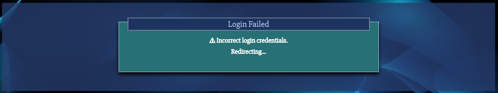

If the user enters the wrong information, they are presented with an invalid login page and redirected back to the login form.

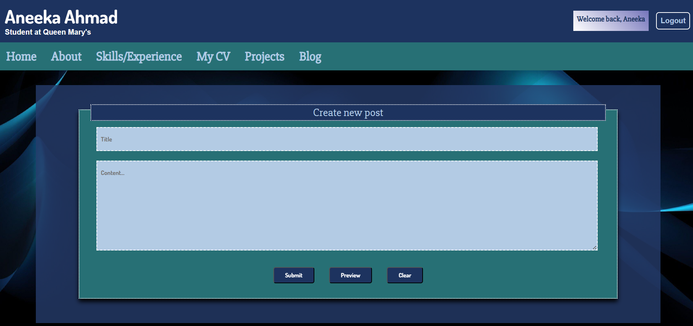

Upon successful login, the user is taken to the add post page and they can fill in the title and content of the post. Again, these fields cannot be left blank. Once submit is clicked, the post is added to the blog and the database is updated. Posts store the timestamp of when the post was submitted, which is displayed in the blog. Entries can be filtered by month, which works by extracting the datetime from the table and using a PHP sort algorithm.

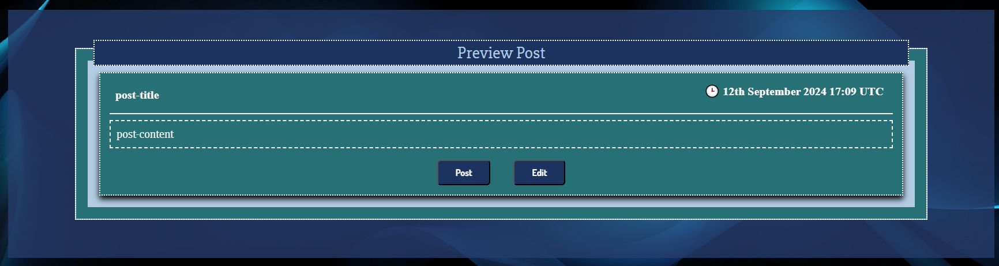

Pressing preview displays what the post will look like. Then the user can choose to go back and edit it or submit the post. Going back to edit retains the entered post data using localStorage.

## Accessibility

To make the website responsive to be able to display and function correctly on all devices, I created another css file to replace the layouts. Some grid layouts became a narrower flexbox, while other layouts were just reorganised grids, making better use of empty spaces.

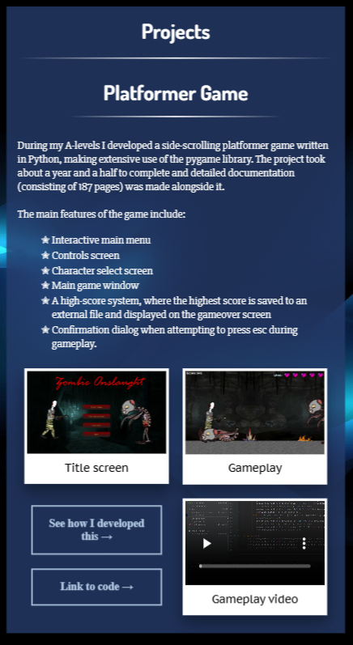

<!-- CONTACT -->
## Contact

Aneeka Ahmad - ahmadaneeka@outlook.com

Project Link: [https://github.com/Pie-R-Squared/Portfolio/](https://github.com/Pie-R-Squared/Portfolio)
